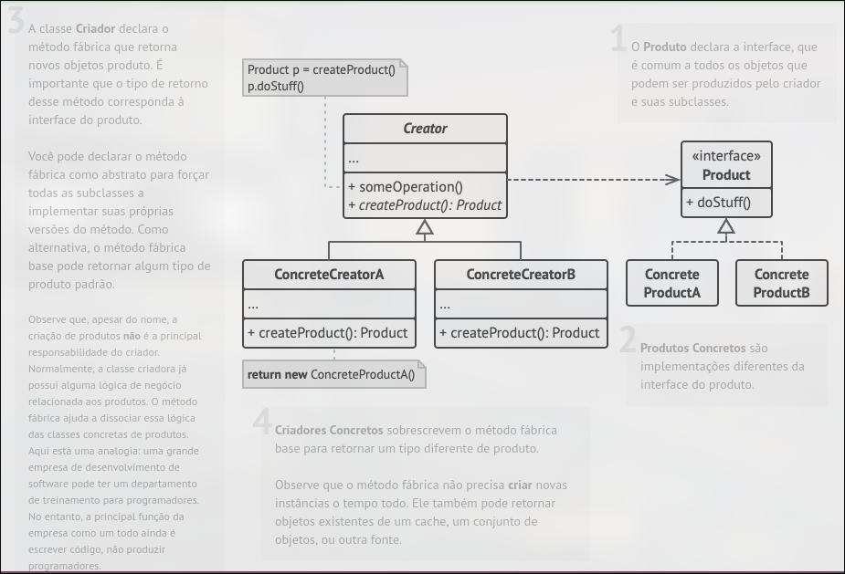
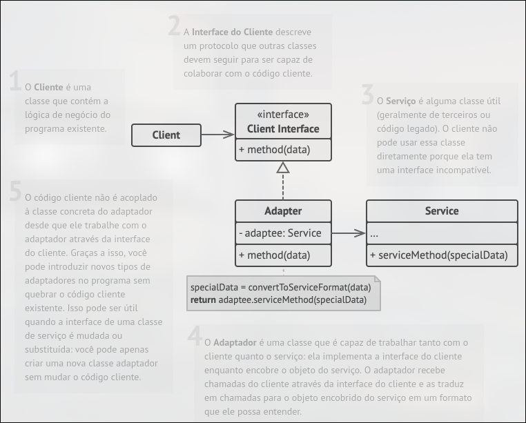
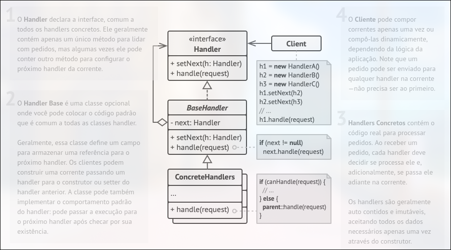

# Trabalho Engenharia de Software - Padrões De Projeto
O presente trabalho tem como objetivo, apresentar 3 padrões de projeto, um criacional, um estrutural e um comportamental. O presente trabalho tem exemplos de códigos retirados do site [refactoring.guru](https://refactoring.guru/pt-br), os exemplos estarão todos na linguagem Go(golang), a explicação sobre para que serve cada um, o que são e o respectivo UML ficarão logo abaixo de cada título.
## Padrão Criacional - Factory Method

### O que é e para que serve.
O Factory Method é um padrão de projeto criacional que fornece uma interface para criar objetos em uma superclasse, permitindo que as subclasses alterem o tipo de objetos que serão criados. Esse padrão é útil quando você precisa adicionar novas classes de objetos ao programa sem modificar o código existente que depende das classes atuais.

A solução proposta pelo Factory Method é substituir chamadas diretas de construção de objetos por chamadas para um método fábrica especial. As subclasses podem sobrescrever esse método fábrica para criar diferentes tipos de objetos. Esses objetos retornados pelo método fábrica são chamados de produtos. É importante que todos os produtos sigam uma interface comum.

Dessa forma, o código cliente que utiliza o método fábrica não precisa conhecer a classe específica do produto, tratando todos os objetos de transporte como um Transporte abstrato. Isso permite adicionar novos tipos de transporte sem quebrar o código existente.

O padrão Factory Method facilita a adição de novos tipos de objetos em um programa, mantendo um código mais limpo e com baixo acoplamento entre classes.

### Exemplo de código em Golang
```
package main

import "fmt"

type Gun struct {
    name  string
    power int
}

func (g *Gun) setName(name string) {
    g.name = name
}

func (g *Gun) getName() string {
    return g.name
}

func (g *Gun) setPower(power int) {
    g.power = power
}

func (g *Gun) getPower() int {
    return g.power
}

type IGun interface {
    setName(name string)
    setPower(power int)
    getName() string
    getPower() int
}

type Ak47 struct {
    Gun
}

func newAk47() IGun {
    return &Ak47{
        Gun: Gun{
            name:  "AK47 gun",
            power: 4,
        },
    }
}

type musket struct {
    Gun
}

func newMusket() IGun {
    return &musket{
        Gun: Gun{
            name:  "Musket gun",
            power: 1,
        },
    }
}

func getGun(gunType string) (IGun, error) {
    if gunType == "ak47" {
        return newAk47(), nil
    }
    if gunType == "musket" {
        return newMusket(), nil
    }
    return nil, fmt.Errorf("Wrong gun type passed")
}

func main() {
    ak47, _ := getGun("ak47")
    musket, _ := getGun("musket")

    printDetails(ak47)
    printDetails(musket)
}

func printDetails(g IGun) {
    fmt.Printf("Gun: %s", g.getName())
    fmt.Println()
    fmt.Printf("Power: %d", g.getPower())
    fmt.Println()
}

```
### Explicação
Como Golang não é uma linguagem OO ele não dispõe de classes ou herança, somente structs e embebeding, e portanto o padrão é implementado de uma maneira diferente, mais simples pode se dizer, o exemplo acima implementa vários tipos de armas usando uma struct factory.

Primeiro, criamos a interface iGun, que define todos os métodos que uma arma deve ter. Existe um tipo de struct gun que implementa a interface iGun. Duas armas concretas — ak47 e musket — ambas incorporam a struct da arma e indiretamente implementam todos os métodos iGun.

A struct gunFactory serve como um factory, que cria armas do tipo desejado com base em um argumento de entrada. O main.go atua como o cliente. Em vez de interagir diretamente com o ak47 ou musket, ele conta com o gunFactory para criar instâncias de várias armas, usando apenas parâmetros de tipo string para controlar a produção.

### UML - Padrão Factory Method


## Padrão Estrutural - Adapter
Também chamado de Wrapper

### O que é e para que serve.
O nome do padrão é claro o suficiente para explicar o que ele é e para que serve, ele serve para que objetos com interfaces incompativeis possam interagir entre si. Simples não?

### Exemplo de código em Golang
```
package main

import "fmt"

type Client struct {
}

func (c *Client) InsertLightningConnectorIntoComputer(com Computer) {
    fmt.Println("Client inserts Lightning connector into computer.")
    com.InsertIntoLightningPort()
}

type Computer interface {
    InsertIntoLightningPort()
}

type Mac struct {
}

func (m *Mac) InsertIntoLightningPort() {
    fmt.Println("Lightning connector is plugged into mac machine.")
}

type Windows struct{}

func (w *Windows) insertIntoUSBPort() {
    fmt.Println("USB connector is plugged into windows machine.")
}

type WindowsAdapter struct {
    windowMachine *Windows
}

func (w *WindowsAdapter) InsertIntoLightningPort() {
    fmt.Println("Adapter converts Lightning signal to USB.")
    w.windowMachine.insertIntoUSBPort()
}

func main() {

    client := &Client{}
    mac := &Mac{}

    client.InsertLightningConnectorIntoComputer(mac)

    windowsMachine := &Windows{}
    windowsMachineAdapter := &WindowsAdapter{
        windowMachine: windowsMachine,
    }

    client.InsertLightningConnectorIntoComputer(windowsMachineAdapter)
}
```
### Explicação
Temos um código cliente que espera alguns recursos de um objeto (Lightning port), mas temos outro objeto chamado adaptee (laptop Windows) que oferece a mesma funcionalidade, mas por meio de uma interface diferente (porta USB)

É aqui que o padrão Adapter entra em cena. Criamos um tipo de struct conhecido como adapter que irá:

    - Seguir a mesma interface que o cliente espera (Lightning port).

    - Traduzir a solicitação do cliente para o adapter na forma que o adapter espera. O adapter aceita um conector Lightning e, em seguida, converte seus sinais em um formato USB e os passa para a porta USB no laptop com Windows.

### UML - Padrão Adapter


## Padrão Comportamental - Chain of Responsability
Também conhecido como:  CoR, Corrente de responsabilidade, Corrente de comando, Chain of command

### O que é e para que serve.
O padrão Chain of Responsibility permite criar uma cadeia de objetos onde cada objeto tem a oportunidade de tratar ou passar adiante uma solicitação, promovendo o desacoplamento e a flexibilidade na definição do fluxo de processamento.

### Exemplo de código em Golang
```
package main

import "fmt"

type Department interface {
    execute(*Patient)
    setNext(Department)
}

type Reception struct {
    next Department
}

func (r *Reception) execute(p *Patient) {
    if p.registrationDone {
        fmt.Println("Patient registration already done")
        r.next.execute(p)
        return
    }
    fmt.Println("Reception registering patient")
    p.registrationDone = true
    r.next.execute(p)
}

func (r *Reception) setNext(next Department) {
    r.next = next
}

type Doctor struct {
    next Department
}

func (d *Doctor) execute(p *Patient) {
    if p.doctorCheckUpDone {
        fmt.Println("Doctor checkup already done")
        d.next.execute(p)
        return
    }
    fmt.Println("Doctor checking patient")
    p.doctorCheckUpDone = true
    d.next.execute(p)
}

func (d *Doctor) setNext(next Department) {
    d.next = next
}

type Medical struct {
    next Department
}

func (m *Medical) execute(p *Patient) {
    if p.medicineDone {
        fmt.Println("Medicine already given to patient")
        m.next.execute(p)
        return
    }
    fmt.Println("Medical giving medicine to patient")
    p.medicineDone = true
    m.next.execute(p)
}

func (m *Medical) setNext(next Department) {
    m.next = next
}

type Cashier struct {
    next Department
}

func (c *Cashier) execute(p *Patient) {
    if p.paymentDone {
        fmt.Println("Payment Done")
    }
    fmt.Println("Cashier getting money from patient patient")
}

func (c *Cashier) setNext(next Department) {
    c.next = next
}

type Patient struct {
    name              string
    registrationDone  bool
    doctorCheckUpDone bool
    medicineDone      bool
    paymentDone       bool
}

func main() {

    cashier := &Cashier{}

    //Set next for medical department
    medical := &Medical{}
    medical.setNext(cashier)

    //Set next for doctor department
    doctor := &Doctor{}
    doctor.setNext(medical)

    //Set next for reception department
    reception := &Reception{}
    reception.setNext(doctor)

    patient := &Patient{name: "abc"}
    //Patient visiting
    reception.execute(patient)
}
```

### Explicação
Acima temos o caso de um aplicativo de hospital. Um hospital pode ter vários departamentos, como:
    - Recepção
    - Médico
    - Sala de remédios
    - Caixa
Sempre que chega algum paciente, ele vai primeiro para a Recepção, depois para o Médico, depois para a Sala de Remédios e depois para o Caixa (e assim por diante). O paciente está sendo enviado por uma cadeia de departamentos, onde cada departamento o envia mais adiante na cadeia, uma vez que sua função esteja concluída.

O padrão é aplicável quando há vários candidatos para processar a mesma solicitação. Quando você não quer que o cliente escolha o receptor, pois vários objetos podem lidar com a solicitação. Além disso, você deseja desacoplar o cliente dos receptores. O cliente só precisa conhecer o primeiro elemento da cadeia.

Como no exemplo do hospital, o paciente primeiro vai até a recepção. Então, com base no status atual do paciente, a recepção envia para o próximo handler da cadeia.

### UML - Padrão Chain of Responsability

